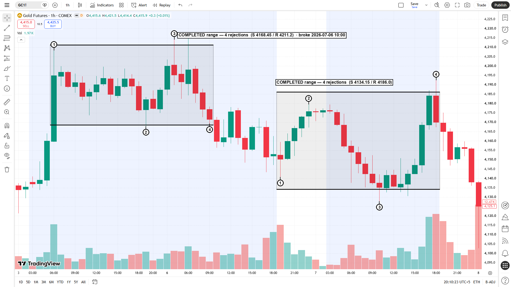
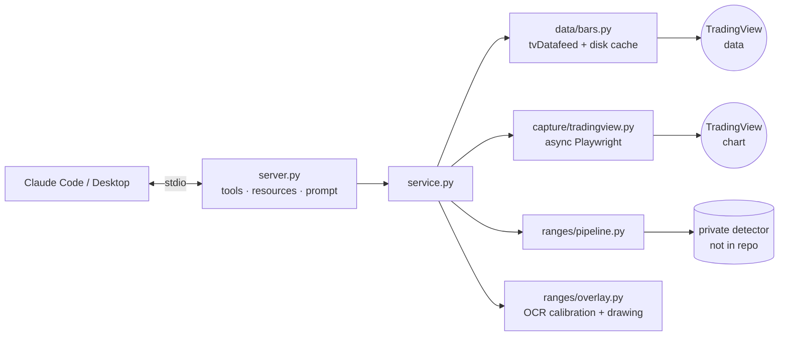

# Futures MCP

[](https://github.com/usamahassan965/futures-mcp/actions/workflows/ci.yml)


An [MCP](https://modelcontextprotocol.io) server that lets Claude look at the futures market:
fetch OHLCV bars with relative volume, capture a TradingView chart framed on an exact
trading-day window, detect whether a **range setup** formed, and return the chart with the
range drawn on it.

> **Ask Claude:** *"Did gold set up a range on H1 over the three days to July 7?"*
> It calls `get_range_chart` and answers with the verdict, the levels and this chart:



Two completed ranges were found. Each has support/resistance, numbered rejections in the
order they happened, and the time the first one broke. Everything was drawn on a live
TradingView screenshot, whose axes were read by OCR so the boxes land on the right
prices and bars.

## Tools

| Tool | What it returns | Typical time |
|---|---|---|
| `get_futures_bars` | OHLCV bars for N trading days with Relative Volume (volume / SMA14), its zone, the session tag of each bar, per-day summaries | < 2 s (cached) |
| `capture_chart` | PNG of the TradingView chart framed on exactly that window, plus the saved path | 20–40 s |
| `analyze_range` | Verdict `COMPLETED` / `NOT_COMPLETED` / `NO_RANGE`, with each structure's support, resistance, rejections and break time | 2–5 s |
| `get_range_chart` | The chart with the detected range drawn on it, plus the same report | 30–50 s |

Also:

- **Resources:** `futures://symbols` lists the supported symbols; `futures://status` reports the capture mode and whether the detector and OCR are available.
- **Prompt:** `range_check` is a ready-made "check this symbol for a range" workflow.

Every tool has a typed output schema (`structuredContent`) and read-only annotations. The long-running tools report progress.

## How it works



1. **One window everywhere.** `timewindow.window_utc(end_date, days)` defines the trading-day window. The bar fetch, the screenshot (framed through TradingView's *Go to → Custom range*) and the scan all use it, so the bars and the chart describe exactly the same span.
2. **Bars and screenshot fetched concurrently** in `get_range_chart` (an `anyio` task group). A shared Chromium page stays warm between calls; captures are serialised because the chart is one piece of UI state.
3. **Detection** runs the private detector over the window's 2- and 3-day sub-windows, dedupes the hits, drops ranges contained in a wider one, and numbers the rejections.
4. **Calibration.** Tesseract reads the price and time axis labels, and a least-squares fit maps price to pixels and time to pixels. If the fit is loose (RMS ≥ 1 px), or the window's high/low would fall outside the price pane, nothing is drawn and the tool returns the clean screenshot with a warning. The verdict is unaffected either way.
5. **Chart settings are forced to match the data:** the axis timezone is set to UTC+5, and back-adjustment for contract rolls (B-ADJ) is turned off for the shot. If a saved layout had B-ADJ on, it is restored afterwards.

## Setup

Requirements: Python 3.11+, [Tesseract](https://github.com/tesseract-ocr/tesseract) (on
Windows the default `C:\Program Files\Tesseract-OCR` install is found automatically).

```bash
conda create -n futures_mcp python=3.12 -y
conda activate futures_mcp
pip install -e ".[dev]"
pip install "tvdatafeed @ git+https://github.com/stefanomorni/fork-tvdatafeed.git"
playwright install chromium
```

> **Playwright version:** if `playwright install` cannot download the latest Chromium
> build (CDN timeouts), pin Playwright to match a Chromium you already have. For example,
> `pip install playwright==1.58.0` uses Chromium build 1208.

Copy `.env.example` to `.env` if you want to change anything. All settings are optional.

### Capture modes

- **Anonymous (default).** TradingView's public chart. No account needed.
- **Session.** Set `TRADINGVIEW_SESSION_ID` (your `sessionid` cookie) and `TRADINGVIEW_URL` (your saved layout). Captures then use your own layout, indicators and colours. Keep the cookie in `.env`, which is git-ignored.

### The range detector is private

The detection rules are proprietary and are **not** in this repository. At runtime the
server imports `range_screener_v6.py` from `FUTURES_MCP_DETECTOR_DIR` (default
`./private`, which is git-ignored). The contract it must meet is documented in
[`ranges/detector.py`](src/futures_mcp/ranges/detector.py).

Without the detector, `get_futures_bars` and `capture_chart` work normally. The two range
tools return a clear error straight away, before spending any time in the browser.

To try the range tools without the private rules, point the server at the **toy example
detector** in [`examples/detector/`](examples/detector/range_screener_v6.py):

```bash
FUTURES_MCP_DETECTOR_DIR=examples/detector
```

It meets the same contract with deliberately naive logic: the box is the first day's
high/low, and 4 alternating edge touches count as complete. Its results are **not** the
ones shown above. CI uses it to run the range pipeline end to end.

## Connect it to Claude

### Claude Code (plugin)

The repo is also a Claude Code plugin marketplace. Install the plugin once and the
server is available in every session:

```bash
claude plugin marketplace add usamahassan965/futures-mcp
claude plugin install futures-mcp@futures-mcp
```

The plugin runs `${FUTURES_MCP_PYTHON:-python} -m futures_mcp`. Point it at the
environment you installed into by adding this to `~/.claude/settings.json`:

```json
{ "env": { "FUTURES_MCP_PYTHON": "C:/Users/<you>/miniconda3/envs/futures_mcp/python.exe" } }
```

Claude Code starts servers from whatever folder a session is in, so put your settings
in the per-user file `~/.futures-mcp/.env` (same keys as `.env.example`), using absolute
paths for `FUTURES_MCP_DATA_DIR` and `FUTURES_MCP_DETECTOR_DIR`. Then ask
*"Is GC setting up a range on H1?"*.

Without the plugin:

```bash
claude mcp add futures -s user -- C:/Users/<you>/miniconda3/envs/futures_mcp/python.exe -m futures_mcp
```

### Claude Desktop

Claude Desktop also starts servers from its own working directory: use `~/.futures-mcp/.env`
as above, or give absolute paths in the config. Edit
`%APPDATA%\Claude\claude_desktop_config.json` (on macOS:
`~/Library/Application Support/Claude/claude_desktop_config.json`):

```json
{
  "mcpServers": {
    "futures": {
      "command": "C:/Users/<you>/miniconda3/envs/futures_mcp/python.exe",
      "args": ["-m", "futures_mcp"],
      "env": {
        "FUTURES_MCP_DATA_DIR": "C:/Users/<you>/futures-mcp/data",
        "FUTURES_MCP_DETECTOR_DIR": "C:/Users/<you>/futures-mcp/private"
      }
    }
  }
}
```

Both work on a Claude Pro subscription. The server runs locally over stdio, so no API key is needed.

### MCP Inspector

```bash
npx @modelcontextprotocol/inspector python -m futures_mcp
```

## Development

```bash
pytest        # unit + golden + in-memory MCP protocol tests
ruff check .
mypy
```

- **Golden tests.** Three recorded GC windows (`COMPLETED`, `NOT_COMPLETED`, `NO_RANGE`) in `tests/fixtures/`:
  - Re-scanning them must reproduce the recorded structures.
  - Re-drawing them must reproduce the recorded marked charts pixel for pixel.
- **Protocol tests.** An in-memory `mcp.Client` runs against the real server with only the network edges faked, i.e. the bar feed and the browser. They cover schemas, argument validation, error mapping, progress, images and structured output.
- **CI** runs on Ubuntu with Python 3.11 and 3.12. Tests that need the private detector are skipped there; the toy detector test still runs the range pipeline.

## Scope and limits

- Symbols: `GC1!` (COMEX gold). Adding a symbol is one line in `symbols.py`.
- Timeframes: bars and charts on H1/H4; range detection on H1, where it is calibrated.
- Times are shown in UTC+5 (the chart axis) and UTC.
- Not financial advice. This is an analysis tool.

## License

MIT
